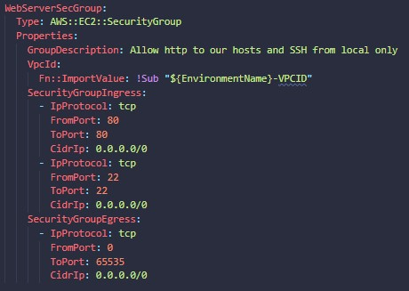

# **Programatically creating an infrastructure**

## **Resources**

* Most important part of the .yml file
* Order is not important
  * order in a way you think is most logical

___

## **VPC**

lay out a vpc to start out our network
(this will create another vpc along side aws's default vpc)

### **CIDR**

* For a vpc you need a cidr
  * the cidr tells you the allocation of the ip , basically the size of your infrastructure
    * laymens: list of ips available on your infrastructure

___

## **InternetGateway**

Since we are replacing the default vpc, for the newly created vpc to have severs that can access the internet and vise versa it is necessary to create an internet gateway.

***Without an internet gateway access to the internet is not possible.***

It is a gateway to connect your VPC to the outside.

### **InternetGatewayAttachment**

Attaches the InternetGateway to the VPC.

* Parameters:
  * InternetGateway
  * VPC

___

## **Subnets**

***A subnet means a switch, so every switch you should ask how many ip addresses can it hold. How many maximum servers can connect to this switch?***

***make sure to select different zones if using multiple subnets***

### **Public Subnets**

### Value for public Subnets

The number of ip available for public subnet 1 is:

    10.0.0.0/24 = 28 = 256 max servers on the subnet

The number of ip available for public subnet 2 is:

    10.0.1.0/24 = 28 = 256 max servers on the subnet

nothing changes since we are just using a mask on the cidr

### **Private Subnets**

***MapPublicIpOnLaunch* set to false because it is best practice for private subnets!**

#### Value for private Subnets

___

## **NAT**

**First create a NAT and then an association.**

### ***NAT With Elastic IP***

Defined in type to have an ***EIP (elastic ip)*** for the domain of the **VPC** using the **InternetGatewayAttachment**.

Associate the **EIP** with the **NAT** and then create an association to the **Subnet**

Get **AllocationId** attribute from **NatGateway1EIP** then associate with **PublicSubnet1**.

___

## ***RoutingTable***

Creating A routing table resource for private and public use.

### ***Public Routing***

    Properties state that it belongs to the provided VPC and adding a tag to it

### ***Default***

* ***Most important part for the routing.***
* ***Defines the rules***

Anyone can connect to you and you can connect to anyone using **InternetGateway**.

    0.0.0.0/0 means anyone, but they go through the InternetGateway

### ***Private Routing***

**PrivateDefaultRoute** states that to go out of network you have to use **NatGateway1**

## ***Security Groups***

* AWS security group **acts as a virtual firewall** for your EC2 instances to control incoming and outgoing traffic.
* Both inbound and outbound rules control the flow of traffic to and traffic from your instance, respectively.

## ***Public Server Instances***

EC2 instances added to public subnets used to connect to the internet, and jump into private instances (since they are located in the same VPC).

## ***Private Server Instances***

EC2 Instances added to private subnets, **only accessible from within the network**.

## ***Web Server Group***

Security group that allows http to the hosts and ***ssh from local only***.

___

# ***Accessing the Private Servers***

To access the Private Servers you need to first be on the same VPC.
So you need to have what is called a jump box, basically a public server on the same VPC.

Simply ssh into the public server and then ssh into the private server to gain access.

___

# ***Finished Infrastructure***

